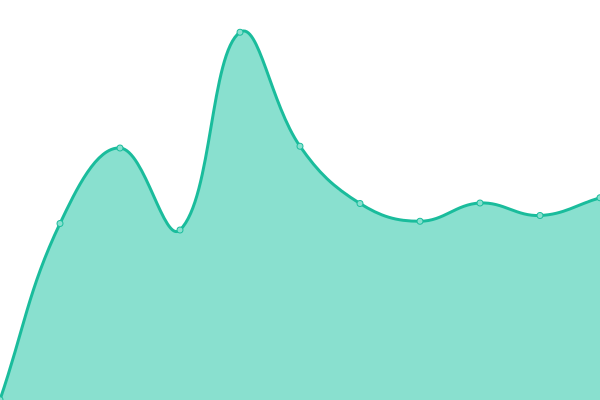

# [📈 Live Status](https://status.marturieathonita.ro): <!--live status--> **🟧 Partial outage**

This repository contains the open-source uptime monitor and status page for [Upptime](https://upptime.js.org), powered by [Upptime](https://github.com/upptime/upptime).

With [Upptime](https://upptime.js.org), you can get your own unlimited and free uptime monitor and status page, powered entirely by a GitHub repository. We use [Issues](https://github.com/upptime/upptime/issues) as incident reports, [Actions](https://github.com/upptime/upptime/actions) as uptime monitors, and [Pages](https://status.marturieathonita.ro) for the status page.

<!--start: status pages-->
<!-- This summary is generated by Upptime (https://github.com/upptime/upptime) -->
<!-- Do not edit this manually, your changes will be overwritten -->
<!-- prettier-ignore -->
| URL | Status | History | Response Time | Uptime |
| --- | ------ | ------- | ------------- | ------ |
|  [MarturieAthonita.ro](https://marturieathonita.ro) | 🟩 Up | [marturie-athonita-ro.yml](https://github.com/CortexNetwork/uptime/commits/HEAD/history/marturie-athonita-ro.yml) | 

 1042ms
     
 | 

<a href="https://status.marturieathonita.ro/history/marturie-athonita-ro">100.00%</a>
    

|  [AthoniteTestimony.com](https://athonitetestimony.com) | 🟩 Up | [athonite-testimony-com.yml](https://github.com/CortexNetwork/uptime/commits/HEAD/history/athonite-testimony-com.yml) | 

 798ms
     
 | 

<a href="https://status.marturieathonita.ro/history/athonite-testimony-com">100.00%</a>
    

|  [Radio Marturie Athonita](https://radio.mountathos.info/live) | 🟥 Down | [radio-marturie-athonita.yml](https://github.com/CortexNetwork/uptime/commits/HEAD/history/radio-marturie-athonita.yml) | 

 0ms
     
 | 

<a href="https://status.marturieathonita.ro/history/radio-marturie-athonita">23.89%</a>
    

<!--end: status pages-->

[**Visit our status website →**](https://status.marturieathonita.ro)

## 📄 License

- Powered by: [Upptime](https://github.com/upptime/upptime)
- Code: [MIT](./LICENSE) © [Upptime](https://upptime.js.org)
- Data in the `./history` directory: [Open Database License](https://opendatacommons.org/licenses/odbl/1-0/)
