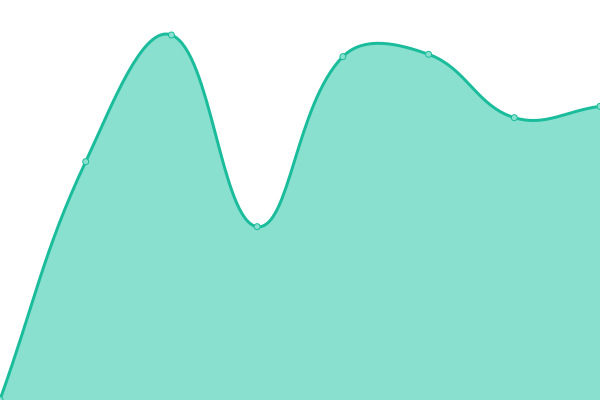

# [📈 Live Status](https://status.marturieathonita.ro): <!--live status--> **🟧 Partial outage**

This repository contains the open-source uptime monitor and status page for [Upptime](https://upptime.js.org), powered by [Upptime](https://github.com/upptime/upptime).

With [Upptime](https://upptime.js.org), you can get your own unlimited and free uptime monitor and status page, powered entirely by a GitHub repository. We use [Issues](https://github.com/upptime/upptime/issues) as incident reports, [Actions](https://github.com/CortexNetwork/upptime/actions) as uptime monitors, and [Pages](https://status.marturieathonita.ro) for the status page.

<!--start: status pages-->
<!-- This summary is generated by Upptime (https://github.com/upptime/upptime) -->
<!-- Do not edit this manually, your changes will be overwritten -->
<!-- prettier-ignore -->
| URL | Status | History | Response Time | Uptime |
| --- | ------ | ------- | ------------- | ------ |
|  [marturieathonita.ro](https://marturieathonita.ro) | 🟥 Down | [marturieathonita-ro.yml](https://github.com/CortexNetwork/uptime/commits/HEAD/history/marturieathonita-ro.yml) | 

 1107ms
     
 | 

<a href="https://status.athonit.com/history/marturieathonita-ro">97.79%</a>
    

|  [cdn.marturieathonita.ro](https://cdn.marturieathonita.ro) | 🟥 Down | [cdn-marturieathonita-ro.yml](https://github.com/CortexNetwork/uptime/commits/HEAD/history/cdn-marturieathonita-ro.yml) | 

 216ms
     
 | 

<a href="https://status.athonit.com/history/cdn-marturieathonita-ro">0.00%</a>
    

|  [athosvestments.com](https://athosvestments.com) | 🟥 Down | [athosvestments-com.yml](https://github.com/CortexNetwork/uptime/commits/HEAD/history/athosvestments-com.yml) | 

 508ms
     
 | 

<a href="https://status.athonit.com/history/athosvestments-com">99.48%</a>
    

|  [athonitetestimony.com](https://athonitetestimony.com) | 🟥 Down | [athonitetestimony-com.yml](https://github.com/CortexNetwork/uptime/commits/HEAD/history/athonitetestimony-com.yml) | 

 1106ms
     
 | 

<a href="https://status.athonit.com/history/athonitetestimony-com">99.48%</a>
    

|  [orthodoxheaven.com](https://orthodoxheaven.com) | 🟥 Down | [orthodoxheaven-com.yml](https://github.com/CortexNetwork/uptime/commits/HEAD/history/orthodoxheaven-com.yml) | 

 535ms
     
 | 

<a href="https://status.athonit.com/history/orthodoxheaven-com">99.48%</a>
    

|  radio-stream | 🟩 Up | [radio-stream.yml](https://github.com/CortexNetwork/uptime/commits/HEAD/history/radio-stream.yml) | 

 145ms
     
 | 

<a href="https://status.athonit.com/history/radio-stream">98.32%</a>
    

<!--end: status pages-->

[**Visit our status website →**](https://status.marturieathonita.ro)

## 📄 License

- Powered by: [Upptime](https://github.com/upptime/upptime)
- Code: [MIT](./LICENSE) © [Upptime](https://upptime.js.org)
- Data in the `./history` directory: [Open Database License](https://opendatacommons.org/licenses/odbl/1-0/)
